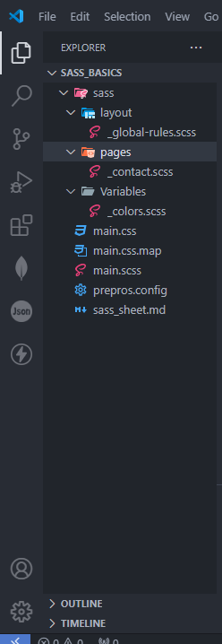
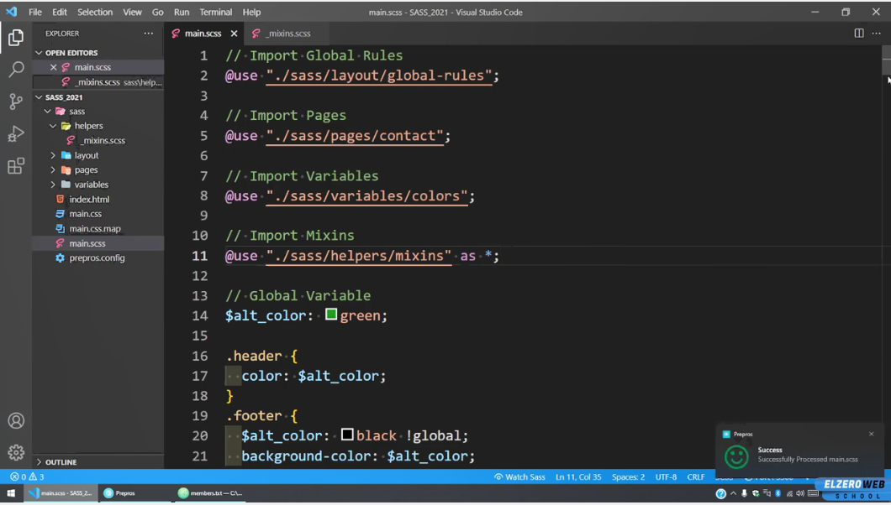
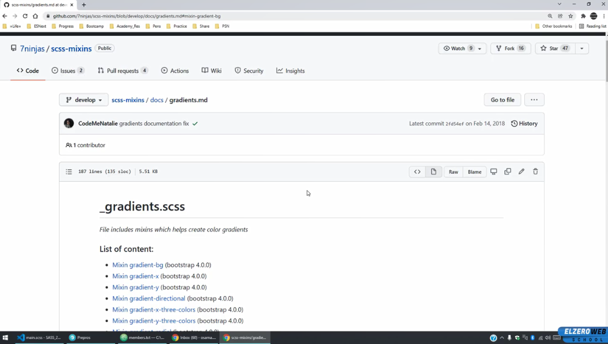

# Sass Sheet 

## 3 


```sass
/* sass/layout/_global-rule.scss */
*{
    box-sizing: border-box;
    margin: 0;
    padding: 0;
}

```

```sass
/* sass/pages/_contact.scss */

```

```sass
/* sass/variables/_colors.scss */
$main_color:rgb(209, 62, 135);
$alt_color:rgb(94, 213, 221);

```

```sass
/* main file main.scss */
// @import './sass/layout/global-rules';
@use './sass/layout/global-rules';

//import contact
@use './sass/pages/contact';
//import ars
@use './sass/Variables/colors';

/* why we to we named the files _file.sass
=> to didn't conpile it imeditly 
=> and make compiltion in one main file 


*/ 


.class_1{
    transform: translateX(5);
}

.class_2{
    background-color: blueviolet;
}

```

###  main.scss main file after compiltion to css

```css
* {
  box-sizing: border-box;
  margin: 0;
  padding: 0;
}

.class_1 {
  transform: translateX(5);
}

.class_2 {
  background-color: blueviolet;
}/*# sourceMappingURL=main.css.map */

```

------------------------

## 4- Variables


```sass
// varibles.scss

$main_color:rgb(209, 62, 135);
$alt_color:rgb(255, 0, 0);
```

```sass
//main.scss

// @import './sass/layout/global-rules';
@use './sass/layout/global-rules';

//import contact
@use './sass/pages/contact';
//import ars
// @use './sass/Variables/colors' as *; //import all ariables
@use './sass/Variables/colors'; // all ariables but use file name before var

/* why we to we named the files _file.sass
=> to didn't conpile it imeditly 
=> and make compiltion in one main file 


*/ 

//global var 

$altColor :rgb(19, 212, 226);
.class_1{
    transform: translateX(5);
}

.class_2{
    background-color: blueviolet;
}


.class_3{
    $altColor :rgb(0, 0, 0);
    background-color:$altColor;
}

.class_3{
    $altColor :rgb(125, 34, 143) !global; // !global to make it global
    background-color:$altColor;
}

.copywrite{ // !global to make it global
    background-color:$altColor;
}


.show{
    background-color:colors.$alt_color;
}

// or 


.show{
    background-color:colors.$alt_color;
}

//============ we can use media too

$max_mobile:"max-width:767px";

@media ($max_mobile) {
    .sideBar{
        background-color: rgb(0, 0, 0);
    }
}


```
###  main.scss main file after compiltion to css
```css
* {
  box-sizing: border-box;
  margin: 0;
  padding: 0;
}

/* why we to we named the files _file.sass
=> to didn't conpile it imeditly 
=> and make compiltion in one main file 


*/
.class_1 {
  transform: translateX(5);
}

.class_2 {
  background-color: blueviolet;
}

.class_3 {
  background-color: rgb(0, 0, 0);
}

.class_3 {
  background-color: rgb(125, 34, 143);
}

.copywrite {
  background-color: rgb(125, 34, 143);
}

.show {
  background-color: rgb(255, 0, 0);
}

.show {
  background-color: rgb(255, 0, 0);
}

@media (max-width:767px) {
  .sideBar {
    background-color: rgb(0, 0, 0);
  }
}/*# sourceMappingURL=main.css.map */

```
-----------------------------
## 5 - Nesting and Parent Element
```sass
// main .scss

// Nesting and parent element


// Without sass
// .parent {
//     font-weight: bold;
// }
// .parent  .child{
//     background-color: aqua;
// }
// .parent  .child .grand-child{
//     font-size: xx-small;
// }

// with sass
.parent {
    font-weight: bold;
    .child{
        background-color: aqua;
        .grand-child{
            font-size: xx-small;
        }
    }
}

// and 

.parent2 {
    font-weight: bold;
    .child2{
        background-color: aqua;
    }
    .grand-child2{
        font-size: xx-small;
    }
}


//========= grouping

.parentOne ,
.parentTwo {
    padding: 20px;
    .child{
        padding: 10px;
    }
}

//======= Advanced Selectors


//===== dirct child in css 

// .parentx > .childx {
    // padding: 5px;
// }
//====== in Sass
.parentx >{
    .childx{
        padding: 5px;
    }
    .test{
        font-weight:bold
    }
}
//------
.parentx {
    > .childx{ // > => to make it the only direct child 
        padding: 5px;
    }
    .test{
        font-weight:bold
    }
    +p{ //+ => Next element
        font-size: 15px;
    }
}
//------
.parentx + { //to make all next element
    .childx{
        padding: 5px;
    }
    .test{
        font-weight:bold;
    }
    p{ //+ => Next element
        font-size: 15px;
    }
}

//------
.parenty{
    >{
        elementOne{
            padding: 2px;
        }
        elementTwo{
            padding: 4px;
        }
        elementThree{
            padding: 6px;
        }
    }
    .not-direct-child{
        padding: 10px;
    }
}

//============ work with parent Element ================


.box{
    .title{
        font-size: 20px;
    }
    .description{
        font-size: 10px;
    }
    &.redx{ //=> = .box.redx
        font-family: 'Courier New', Courier, monospace;
        color: red;
    }
    &.greenx{ //=> = .box.redx
        font-family: 'Courier New', Courier, monospace;
        color: green;
    }
    //=========== Pesudo element and classes================
    &:hover{
        background-color: black;
    }
    &:hover .title{ //=> = p:hover .title {}
        background-color: blue;
    }
    :not(&){
        font-weight: normal;
    }
    [dir = "rtl"] & {
        direction: rtl;
    }
}


```
###  main.scss main file after compiltion to css

```css
.parent {
  font-weight: bold;
}
.parent .child {
  background-color: aqua;
}
.parent .child .grand-child {
  font-size: xx-small;
}

.parent2 {
  font-weight: bold;
}
.parent2 .child2 {
  background-color: aqua;
}
.parent2 .grand-child2 {
  font-size: xx-small;
}

.parentOne,
.parentTwo {
  padding: 20px;
}
.parentOne .child,
.parentTwo .child {
  padding: 10px;
}

.parentx > .childx {
  padding: 5px;
}
.parentx > .test {
  font-weight: bold;
}

.parentx > .childx {
  padding: 5px;
}
.parentx .test {
  font-weight: bold;
}
.parentx + p {
  font-size: 15px;
}

.parentx + .childx {
  padding: 5px;
}
.parentx + .test {
  font-weight: bold;
}
.parentx + p {
  font-size: 15px;
}

.parenty > elementOne {
  padding: 2px;
}
.parenty > elementTwo {
  padding: 4px;
}
.parenty > elementThree {
  padding: 6px;
}
.parenty .not-direct-child {
  padding: 10px;
}

.box .title {
  font-size: 20px;
}
.box .description {
  font-size: 10px;
}
.box.redx {
  font-family: "Courier New", Courier, monospace;
  color: red;
}
.box.greenx {
  font-family: "Courier New", Courier, monospace;
  color: green;
}
.box:hover {
  background-color: black;
}
.box:hover .title {
  background-color: blue;
}
:not(.box) {
  font-weight: normal;
}
[dir=rtl] .box {
  direction: rtl;
}/*# sourceMappingURL=main.css.map */

```
-----------------------------
## 6 -  propertiy declartion and place holder

```sass
// propertiy declartion and place holder

.box {
  font-size: 20px;
  font: {
    size: 15px;
    font-weight: bold;
  }
  padding: 10px;
  margin: auto {
    top: 10px;
    bottom: 15px;
  };
}

//=== place holder
%main-box{
  background-color: white;
  padding: 15px;
  border: 1px solid #ccc;
}

.article {
  background-color: white;
  padding: 15px;
  border: 1px solid #ccc;
  font-size: 22px;
  color: blue;
}
.ads {
  @extend %main-box;
  font-size: 20px;
  color: red;
}

```
###  main.scss main file after compiltion to css
```css
.box {
  font-size: 20px;
  font-size: 15px;
  font-font-weight: bold;
  padding: 10px;
  margin: auto;
  margin-top: 10px;
  margin-bottom: 15px;
}

.ads {
  background-color: white;
  padding: 15px;
  border: 1px solid #ccc;
}

.article {
  background-color: white;
  padding: 15px;
  border: 1px solid #ccc;
  font-size: 22px;
  color: blue;
}

.ads {
  font-size: 20px;
  color: red;
}/*# sourceMappingURL=main.css.map */

```


----------------
## 7 control flow if and else
```sass


// $theme:'light';
$theme:'dark';

.page{
  @if $theme == 'light' {
    background-color: white;
    color: #444;
  }@else{
    background-color: #444;
    color: white;
  }
}

$rounded :false;

.box{
  border-radius: if($rounded,6px,null);
}


```


```css
.page {
  background-color: #444;
  color: white;
}/*# sourceMappingURL=main.css.map */

```
----------------
## 8 - creat triangle with if & else

```html
<!DOCTYPE html>
<html lang="en">
<head>
  <meta charset="UTF-8">
  <meta name="viewport" content="width=device-width, initial-scale=1.0">
  <link rel="stylesheet" href="./main.css">
  <title>Document</title>
</head>
<body>
  <div class="arrow-div">
    Arrow
  </div>
</body>
</html>

```

```sass
// main scss file

%main-box{
  background-color: white;
  padding: 15px;
  border: 1px solid #ccc;
}

$dirction:'left';


.arrow-div{
  @extend %main-box;
  font-size: 20px;
  display: flex;
  justify-content: center;
  align-items: center;
  width: 300px;
  height: 300px;
  position: relative;
  margin: 50px auto;
  &::before{
    content: '';
    position: absolute;
    border: 20px solid transparent;

    @if $dirction =='top' {
      top: -40px;
      left: 50%;
      transform: translateX(-50%);
      border-bottom-color:red ;
    }
    @else if $dirction =='right' {
      right: -40px;
      top: 50%;
      transform: translateY(-50%);
      border-left-color:red ;
    }
    @else if $dirction =='bottom' {
      bottom: -40px;
      left: 50%;
      transform: translateX(-50%);
      border-top-color:red ;
    }
    @else if $dirction =='left' {
      left: -40px;
      top: 50%;
      transform: translateY(-50%);
      border-right-color:red ;
    }@else{
      @error "This is #{$dirction} not valid direction"
    }
  }
}


```
### css file

```css
/* main css file after compilation from scss*/
.arrow-div {
  background-color: white;
  padding: 15px;
  border: 1px solid #ccc;
}

.arrow-div {
  font-size: 20px;
  display: flex;
  justify-content: center;
  align-items: center;
  width: 300px;
  height: 300px;
  position: relative;
  margin: 50px auto;
}
.arrow-div::before {
  content: "";
  position: absolute;
  border: 20px solid transparent;
  left: -40px;
  top: 50%;
  transform: translateY(-50%);
  border-right-color: red;
}/*# sourceMappingURL=main.css.map */

```
----------------------------------

## 9 - interpolation 
```sass
// interpolation 

$company :'elzero';
$postion :'left';

.ad-#{$company}{ // == => ad-elzero
  font-size: 20px;
  background-image:url("./imgs/sass-3.PNG") ;
  #{$postion}:0;
}

.ad-#{$company}-#{unique-id()}{ // == => ad-elzero
  font-size: 20px;
  background-image:url("./imgs/sass-3.PNG") ;
  #{$postion}:0;
}

// unique-id() function add a uniq value 


```
### css 
```css
.ad-elzero {
  font-size: 20px;
  background-image: url("./imgs/sass-3.PNG");
  left: 0;
}

.ad-elzero-uijxpep {
  font-size: 20px;
  background-image: url("./imgs/sass-3.PNG");
  left: 0;
}/*# sourceMappingURL=main.css.map */

```
----------------
## 10 - comment and  Documnting
```sass
//
/* 

*/
```

```css


```
----------------
## 11 - Mixin & Include = function and params in js

```sass
@mixin list-reset{
  padding: 0;
  margin: 0;
  list-style: none;
}

ul.links{
  @include list-reset;
}

//====================


@mixin circle($dimensions){
  border-radius: 50%;
  width: $dimensions;
  height: $dimensions;
}

.circle-100{
  @include circle(100px);
  background-color: red;
  color: white;
}
.circle-200{
  @include circle(200px);
  background-color: blue;
  color: white;
}


```
### css

```css
ul.links {
  padding: 0;
  margin: 0;
  list-style: none;
}

.circle-100 {
  border-radius: 50%;
  width: 100px;
  height: 100px;
  background-color: red;
  color: white;
}

.circle-200 {
  border-radius: 50%;
  width: 200px;
  height: 200px;
  background-color: blue;
  color: white;
}

.center-circle {
  border-radius: 50%;
  width: 400px;
  height: 400px;
  display: flex;
  justify-content: center;
  align-items: center;
}

.center-circle-2 {
  border-radius: 50%;
  width: 500px;
  height: 500px;
  display: flex;
  justify-content: center;
  align-items: center;
}/*# sourceMappingURL=main.css.map */

```

we make mixin library to helpus in our work


ready mixin library



----------------
## 12 - loop
```sass
//=== loop 

@for $i from 1 through 5{ // 1 to 10
  .class-#{$i}{
    font-size: #{$i + 10px};
  }
}
@for $i from 1 to 10{ // to 1-> 9

}

$dimensions:0;

@for $i from 1 through 5{ // 1 to 10
  .circle-#{100 + $dimensions}{
    font-size: #{$i + 10px};
    width: $dimensions + 100px;
    height: $dimensions + 100px;
    border-radius: 50%;
  }
  $dimensions:$dimensions + 100;
}


//====

```


```css
.class-1 {
  font-size: 11px;
}

.class-2 {
  font-size: 12px;
}

.class-3 {
  font-size: 13px;
}

.class-4 {
  font-size: 14px;
}

.class-5 {
  font-size: 15px;
}/*# sourceMappingURL=main.css.map */

/*------------------------*/

.circle-100 {
  font-size: 11px;
  width: 100px;
  height: 100px;
  border-radius: 50%;
}

.circle-200 {
  font-size: 12px;
  width: 200px;
  height: 200px;
  border-radius: 50%;
}

.circle-300 {
  font-size: 13px;
  width: 300px;
  height: 300px;
  border-radius: 50%;
}

.circle-400 {
  font-size: 14px;
  width: 400px;
  height: 400px;
  border-radius: 50%;
}

.circle-500 {
  font-size: 15px;
  width: 500px;
  height: 500px;
  border-radius: 50%;
}/*# sourceMappingURL=main.css.map */


```
----------------
## 13 - Loop Each and Map
```sass


```

```sass


```

```sass


```

```sass


```

```css


```
----------------
## 14 - loop while
```sass


```

```sass


```

```sass


```

```sass


```

```css


```
----------------
## 15 - create bootstrap Grid system
```sass


```

```sass


```

```sass


```

```sass


```

```css


```
----------------
## 16 - Functions 
```sass


```

```sass


```

```sass


```

```sass


```

```css


```
----------------

## 17 - Practice mixin with content
```sass


```

```sass


```

```sass


```

```sass


```

```css


```
----------------
## 18 - practice create media query mixin
```sass


```

```sass


```

```sass


```

```sass


```

```css


```
----------------
## 19 - The End and how to master sass 
```sass


```

```sass


```

```sass


```

```sass


```

```css


```
----------------
## 
```sass


```

```sass


```

```sass


```

```sass


```

```css


```
----------------
## 
```sass


```

```sass


```

```sass


```

```sass


```

```css


```
----------------


